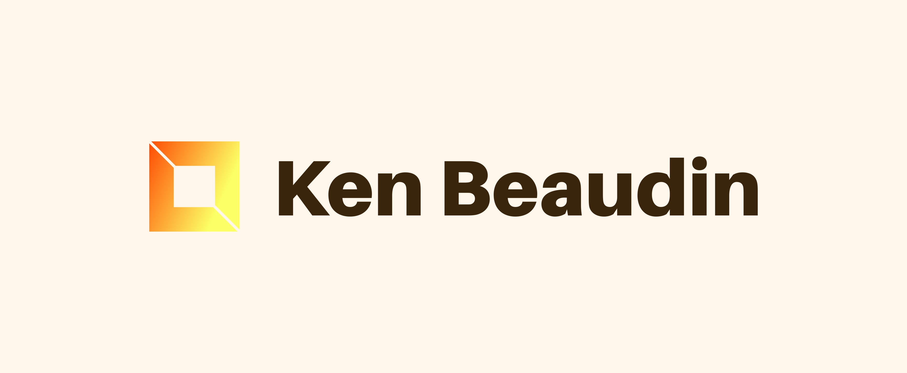

# Ken Beaudin

Custom made portfolio website containing biography, portfolio projects and contact information.

**Website:** https://kenbeaudin.netlify.app/

## How It's Made:

**Tech used:** HTML, CSS, Javascript, NPM, Node.js, Webpack, Git, Github, Netlify

Here's where you can go to town on how you actually built this thing. Write as much as you can here, it's totally fine if it's not too much just make sure you write _something_. If you don't have too much experience on your resume working on the front end that's totally fine. This is where you can really show off your passion and make up for that ten fold.

## Optimizations

Need to fix all Lighthouse scan errors
 
Add linktree linktree icon
 
Resume should be pdf download
 
SEO CHECK LIST
 
https://www.semrush.com/blog/seo-checklist/
 
ACCESABILITY check LIST
 
https://webaccessibilitychecklist.com/
 
Night Mode
 
Optimise image size and location
 
Webpack optimisation
 
Add hamburger menu on wide screen
 
Make Search Bar Work
 
Move images to
 
https://cloudinary.com/

## Lessons Learned:

I programmed the website starting from a mobile design which was a good idea but I should have coded the responsive structure from this size to large size
before adding content. I would have avoided pitfalls I had later when my content had to be changed from small screen size to acomodate to things in terms of content responssiveness I hadn't planned for.
